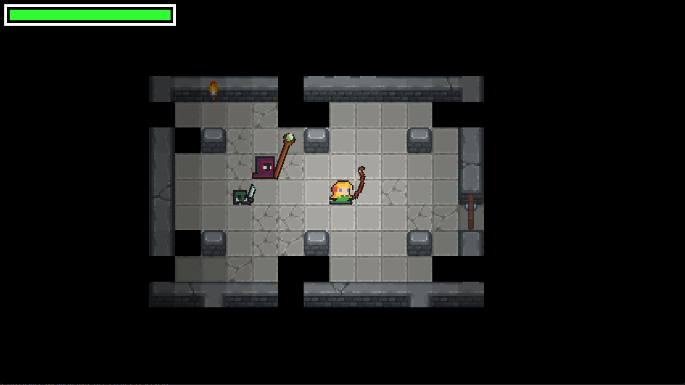
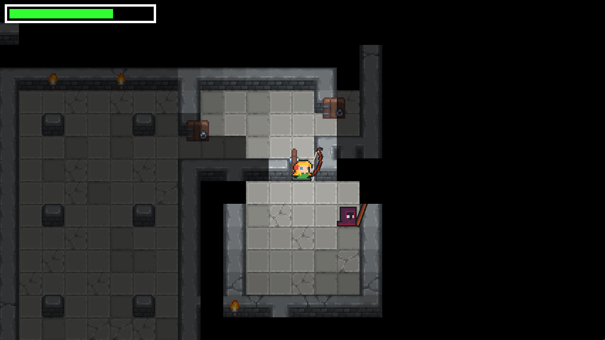

# Defeat the Dungeon

Using a game engine written by WLC professors, I created a dungeon crawl game. The game features an archer who is able to navigate (arrow keys) the randomly generated map, open and close doors (c to close), and avoid or fight monsters.
The archer can fire an arrow in any direction (press b), dealing damage to monsters, and also melees with her bow when close to monsters. Monsters and heroes are programmed to show swing animations when attacking. Monsters are also programmed to pursue the player when visible, and randomly roam the map when the player is not visible.

 


# Game for CSC-231
This code serves as the final project for CSC 231 Software
Development. It consists of a game engine that you will use to create
a game through a series of steps.

The engine written by WLC faculty is built on top of the fantastic
game library [SDL](https://www.libsdl.org/) to handle user input and
graphics. The engine provides features to implement a simple 2D
turn-based game, similar to a
[Roguelike](https://en.wikipedia.org/wiki/Roguelike) game.

The engine by itself does nothing, but by creating concrete types for
Heros, Monsters, Weapons, and Actions, you will be able to write a fun
game rather quickly.


## Building
The game engine is written in C++ and uses features from the C++17
standard. [CMake](https://cmake.org/) is used to build all components.
and works well with the
[CMakeTools](https://marketplace.visualstudio.com/items?itemName=ms-vscode.cmake-tools)
extension in VSCode.

To configure it manually, type

```
cd build
cmake ..
```
then build it using
```
cmake --build .
```

Either method generates an executable in the build directory called
`game`. This executable expects to find the settings

## Running
Unlike in MacOS or Linux, Windows requires that the SDL2 and
SDL2_image libraries files be in the same directory as the
executable. Copy the following `dll` files into the `build` folder.

Make sure that your terminal is open in the same folder that contains
`settings.txt` and run `./build/game` on MacOS/Linux and
`.\build\game.exe` on Windows.


# Folder structure
In this directory, there is a `settings.txt` file that contains
general settings for the game, including screen resolutions and zoom
levels, locations of asset files (images of characters and others),
and some properties for the map.

## Engine
The C++ code for the engine is located inside `engine`. Also inside
this folder are prebuilt libraries for `SDL2` and `SDL2_image`. **You
will not need to modify any code within the engine folder** and for
your sanity, please don't.  However, you will need to **read lots of
code within the engine** in order to know how to use it.


## Content
Place all of your code within the folder `content`. CMake will handle
include paths to files within the engine, so you should be able to
just include the name of the file you wish to use, e.g. `#include
"engine.h"`, and it will just work.

## Assets
The engine can load 2D graphical sprites from png images (called a
[spritesheet](https://en.wikipedia.org/wiki/Texture_atlas)) using a
simple asset file. The first line of the asset file must be the file
name of the png image.  The rest of the file can contain a list of
named sprites and their locations (x, y, width, height) within the
image file. Optionally, if a sprite is animated the number of frames
in the animation can appear after the location. It is assumed that
frames appear horizontally in the image and are equally-spaced. Here's
the format:

```
image_filename.png

name_of_sprite x y width height
animated_sprite x y width height frames
```

The dungeon was designed by and can be purchased from
[SecretHideout](https://secrethideout.itch.io/rogue-dungeon-tileset-16x16).

The heros, monsters, weapons, and items were created by and can be
purchased from [Robert(0x72)](https://0x72.itch.io/dungeontileset-ii).


